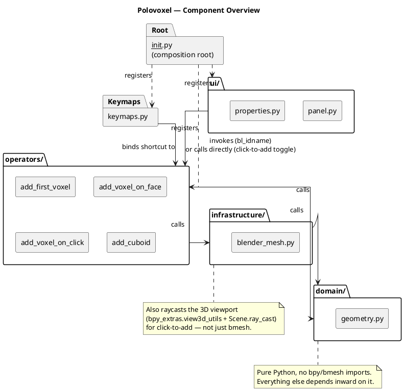
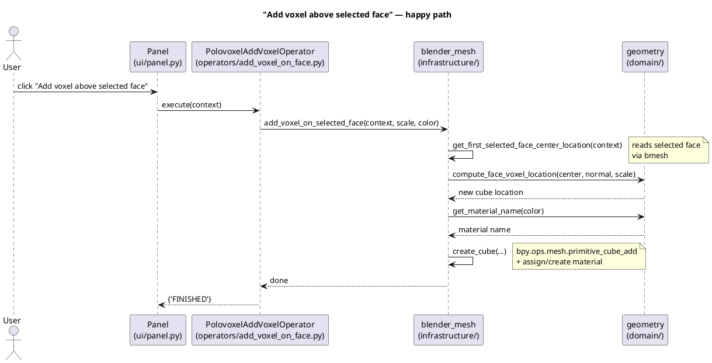
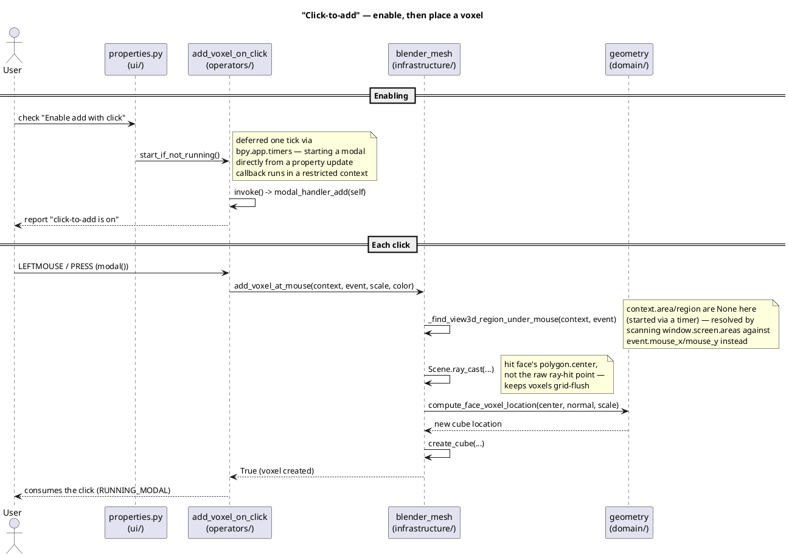

# Architecture Diagrams

Three minimal PlantUML diagrams for the Polovoxel add-on's clean-architecture layout.
See [`../ARCHITECTURE.md`](../ARCHITECTURE.md) for the full written rationale.

## Components

One box per layer/module: `domain/` has no `bpy` dependency, and every other
layer depends inward on it (never the reverse). `__init__.py` is the only
place that wires registration together.



## Sequence: "Add voxel above selected face"

The most illustrative flow: the panel button triggers an operator, which
asks infrastructure for the selected face, hands the raw numbers to domain
for the pure location math, then asks infrastructure again to actually
create the cube and material in Blender.



## Sequence: "Click-to-add"

Genuinely different from the button/shortcut flow above, and worth its own
diagram: enabling the checkbox has to *start* a modal operator (deferred via
`bpy.app.timers`, since starting one directly from a property `update`
callback runs in a restricted context), and each click then raycasts the
viewport directly — no edit-mesh face selection involved, unlike every other
operator.



## Viewing the diagrams

- **VS Code**: install the "PlantUML" extension (jebbs.plantuml), open a
  `.puml` file, and press `Alt+D` to preview.
- **Online**: paste the contents of a `.puml` file into
  [plantuml.com/plantuml](https://www.plantuml.com/plantuml/uml/).
- **CLI**: if you have the `plantuml` command or `plantuml.jar` installed,
  run `plantuml docs/architecture/*.puml` from the repo root to render PNGs
  next to the source files.
- **GitHub**: the fenced ```` ```plantuml ```` blocks above render inline on
  GitHub automatically — no local tooling needed to just read them here.
