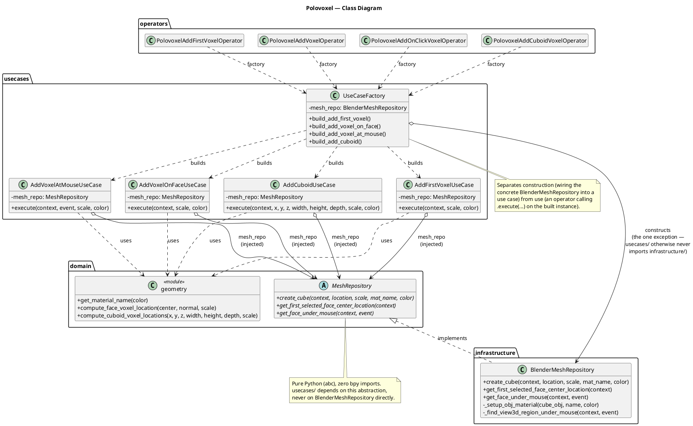
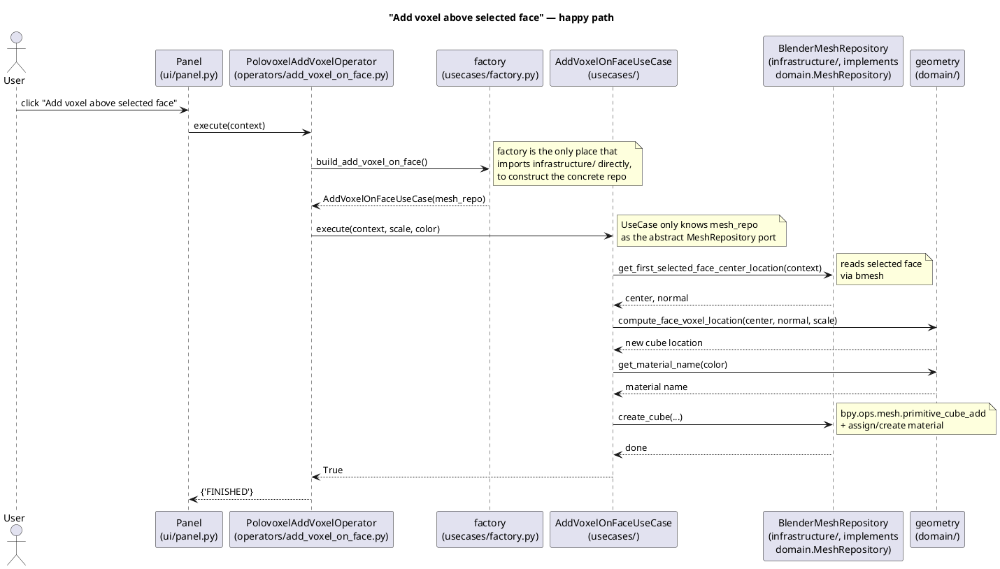
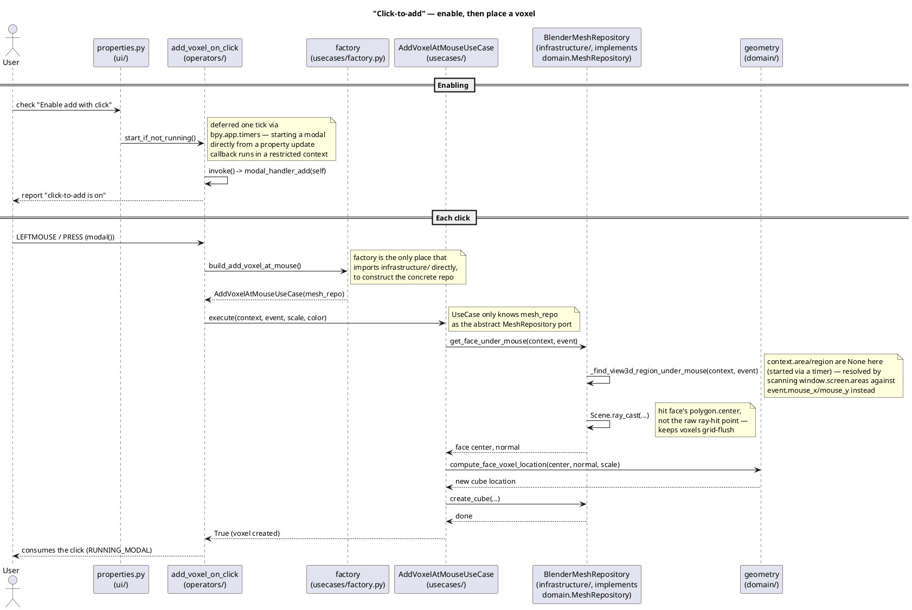

# Architecture Diagrams

Three minimal PlantUML diagrams for the Polovoxel add-on's clean-architecture
layout: one class diagram plus two sequence diagrams for the two distinct
"add a voxel" flows. See [`../ARCHITECTURE.md`](../ARCHITECTURE.md) for the
full written rationale.

## Class Diagram

The actual classes, not just packages: `MeshRepository` is an `abc.ABC`
port defined in `domain/`, `BlenderMeshRepository` (`infrastructure/`) is
its only implementation, each `usecases/` class depends on the abstract
`MeshRepository` (injected through its constructor) rather than the
concrete class, and `UseCaseFactory` is the one place that constructs
`BlenderMeshRepository` and wires it into a use case — the composition
point between the abstraction the use cases depend on and the concrete
adapter that actually implements it. `__init__.py` (not shown) is the only
place that wires operator/UI registration together.



## Sequence: "Add voxel above selected face"

The most illustrative flow: the panel button triggers an operator, which
builds the matching use case from `usecases/factory.py` and calls
`.execute(...)` on it. The use case asks its injected `MeshRepository`
(concretely a `BlenderMeshRepository`, but the use case only knows the
abstract port) for the selected face, hands the raw numbers to domain for
the pure location math, then asks the repository again to actually create
the cube and material in Blender — the operator itself never talks to
`domain/` or `infrastructure/`, and the use case itself never imports
`infrastructure/` either.



## Sequence: "Click-to-add"

Genuinely different from the button/shortcut flow above, and worth its own
diagram: enabling the checkbox has to *start* a modal operator (deferred via
`bpy.app.timers`, since starting one directly from a property `update`
callback runs in a restricted context), and each click then raycasts the
viewport directly — no edit-mesh face selection involved, unlike every other
operator. As with the flow above, the operator only ever talks to the use
case built from `usecases/factory.py`, and the use case only ever talks to
its injected `MeshRepository` port — neither imports `infrastructure/` or
`domain/` beyond that.



## Viewing the diagrams

- **VS Code**: install the "PlantUML" extension (jebbs.plantuml), open a
  `.puml` file, and press `Alt+D` to preview.
- **Online**: paste the contents of a `.puml` file into
  [plantuml.com/plantuml](https://www.plantuml.com/plantuml/uml/).
- **CLI**: if you have the `plantuml` command or `plantuml.jar` installed,
  run `plantuml docs/architecture/*.puml` from the repo root to render PNGs
  next to the source files.
- **GitHub**: the fenced ```` ```plantuml ```` blocks above render inline on
  GitHub automatically — no local tooling needed to just read them here.
